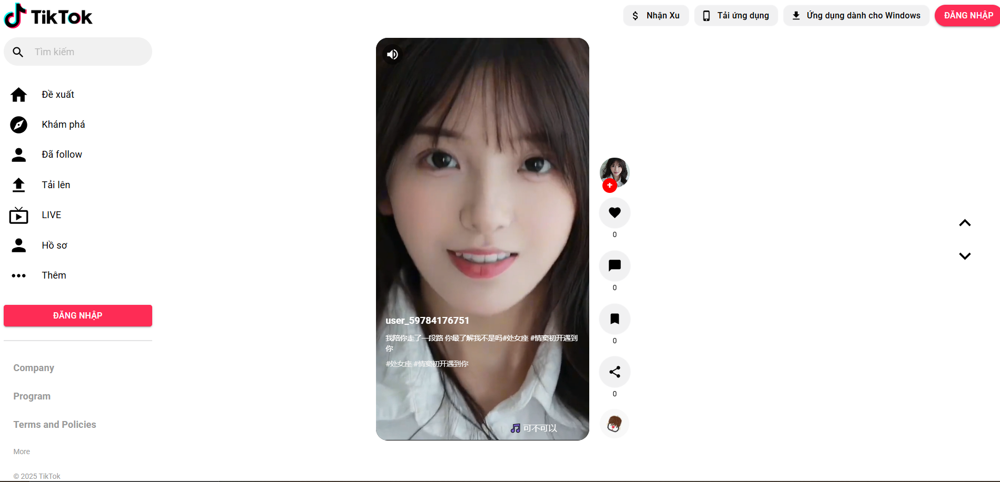

# TikTok Clone with React + Vite

This project is a minimal yet fully functional **TikTok-like video feed** built with **ReactJS + Vite**, inspired by Douyin/TikTok UI/UX.

## 🔥 Features

- 🔁 Infinite scroll with IntersectionObserver
- 🎞️ AutoPlay/Pause based on viewport
- 🔇 Mute/Unmute toggle
- 🎬 Scroll between videos via keyboard or buttons
- ❤️ Basic interaction buttons (like, comment, share...)
- 📥 Fetches videos from a custom backend (Douyin video crawler)
- ⚙️ Modular structure for scalability

## 🚀 Tech Stack

- **Frontend**: React + Vite + MUI
- **Backend**: NestJS (or Express) serving crawled videos from Douyin
- **Video Player**: HTML5 `<video>` with custom controls
- **Tools**: Axios, IntersectionObserver, Custom Hooks


## 📦 Getting Started

```bash
# Install dependencies
npm install

# Start development server
npm run dev
```

## 🌐 Live Demo

